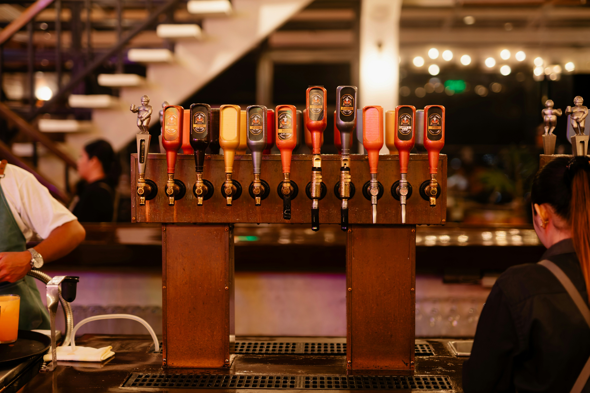

<h1>🍺 Tap Planner</h1>

<strong>Choose your tap date. Tap Planner works backward and tells you when to begin.</strong>

  

  
  
  

<h2>Plan your next pour without counting backward by hand</h2>

Tap Planner is a simple scheduling tool for Pinter owners. Pick an official BrewPack,
choose the day you want it ready, and Tap Planner calculates the full timeline from
brew day through tap day.

<table>
  <tr>
    <td align="center" width="33%">
      <strong>🍺 Pick a BrewPack</strong>  
      Search by name or style and load the official timing details.
    </td>
    <td align="center" width="33%">
      <strong>📅 Choose tap day</strong>  
      Select the date you want your drink ready to pour.
    </td>
    <td align="center" width="33%">
      <strong>✅ Get your schedule</strong>  
      See exactly when to brew, cold crash, condition, and tap.
    </td>
  </tr>
</table>

<h2>Example schedule</h2>

For a July 28 tap date with 8 brewing days, 2 cold-crash days, and 3 conditioning days:

<table>
  <thead>
    <tr>
      <th align="center">🍺 Brew</th>
      <th align="center">❄️ Cold crash</th>
      <th align="center">🟡 Condition</th>
      <th align="center">🔴 Tap</th>
    </tr>
  </thead>
  <tbody>
    <tr>
      <td align="center"><strong>July 15</strong></td>
      <td align="center"><strong>July 23</strong></td>
      <td align="center"><strong>July 25</strong></td>
      <td align="center"><strong>July 28</strong></td>
    </tr>
  </tbody>
</table>

<strong>13 total days from brew start to tap day</strong>

<table>
  <tr>
    <td width="50%" valign="top">
      <h3>Schedule options</h3>
      

      Use official recommended timing for the intended BrewPack schedule,
      or switch to minimum timing when you have less lead time.
      

      

      An optional cold-crash stage can add 1, 2, or 3 days between brewing
      and conditioning.
      

    </td>
    <td width="50%" valign="top">
      <h3>BrewPack information</h3>
      

      Tap Planner includes BrewPack name, style, ABV, recommended timing,
      minimum timing, yeast, Hopper inclusion, and discontinued status.
      

      

      Discontinued BrewPacks remain in the data but are hidden from normal search.
      

    </td>
  </tr>
</table>

<h2>Automatic catalog monitoring</h2>

<table>
  <tr>
    <td align="center" width="25%"><strong>1</strong>  Check Pinter's public BrewPack page</td>
    <td align="center" width="25%"><strong>2</strong>  Validate and compare the catalog</td>
    <td align="center" width="25%"><strong>3</strong>  Run lint and a production build</td>
    <td align="center" width="25%"><strong>4</strong>  Open a pull request for review</td>
  </tr>
</table>

<blockquote>
<strong>Nothing is published silently.</strong> Catalog changes must be reviewed and merged before they reach the live app.
</blockquote>

<h2>Important notice</h2>

Tap Planner is an independent community project. It is not an official Pinter product
and is not affiliated with or endorsed by Pinter.

Use Tap Planner for schedule planning. Continue using the official Pinter app for
active brewing instructions, safety guidance, product support, and decisions during your brew.

<h3>Developer documentation</h3>

Technical setup, project structure, BrewPack importing, automated monitoring,
and deployment details are available in the
<a href="docs/DEVELOPMENT.md">developer documentation</a>.

<strong>Built for better brew planning. 🍻</strong>

