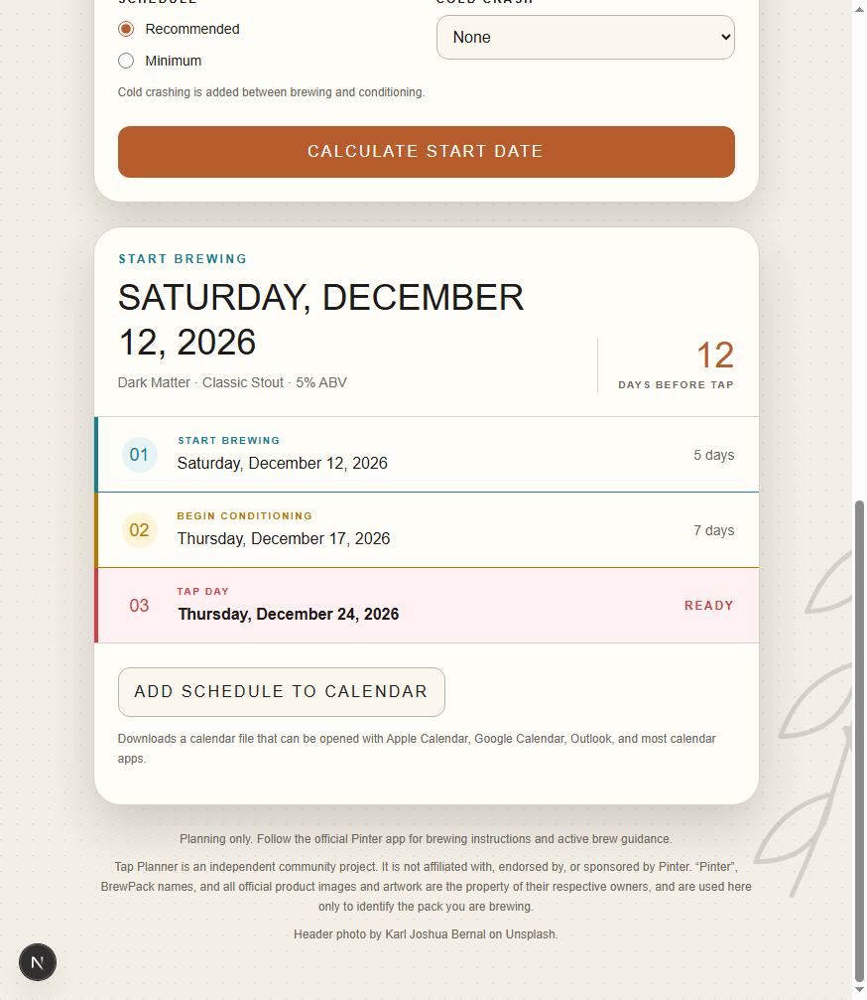
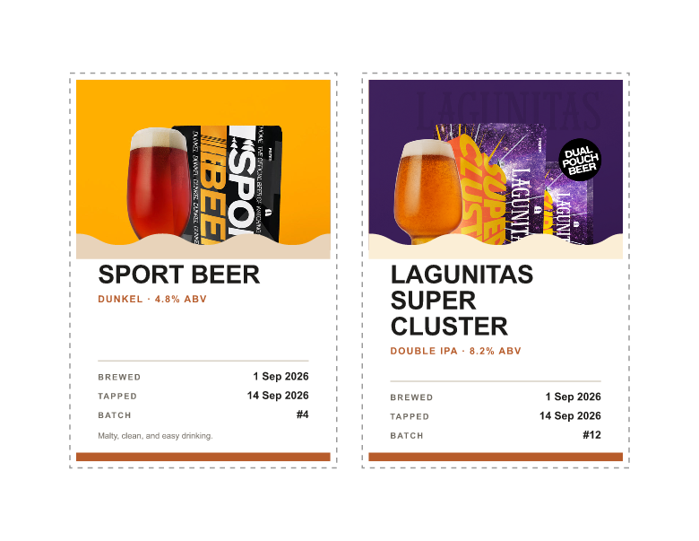
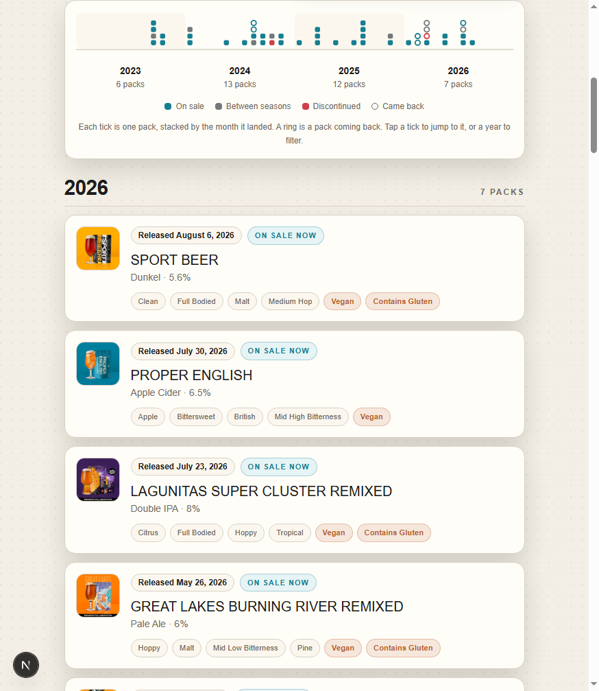
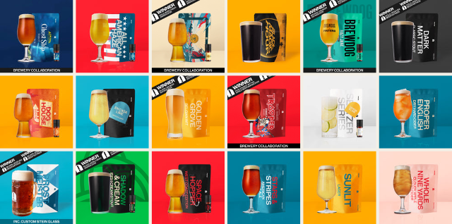

<div align="center">

# 🍺 Tap Planner

**Choose your tap date. Tap Planner works backward and tells you when to begin.**

[](https://tap-planner.vercel.app/)

[](https://nextjs.org/)
[](https://www.typescriptlang.org/)
[](https://vercel.com/)



</div>

---

Pinter tells you how long a BrewPack takes. It doesn't tell you when to start
if you want it ready for a particular day. Tap Planner does that arithmetic —
fermentation, an optional cold crash, and conditioning, counted backward from
your tap date — and then gets out of the way.

No accounts, no database, nothing stored. Every calculation happens in your
browser.

## Five ways to use it

| | Page | Use it when |
|---|---|---|
| 🍺 | **BrewPack planner** — `/` | You're brewing an official pack and want its recommended or minimum timing |
| 🧪 | **Custom planner** — `/custom` | You're brewing your own recipe, or overriding a pack's timing |
| 🔄 | **Rotation planner** — `/rotation` | You run several Pinters and want them staggered so you never run dry |
| 📅 | **Release timeline** — `/releases` | You want to know when a pack appeared, or when a seasonal might return |
| 🏷️ | **Brew labels** — `/labels` | You want to know what's actually in the fridge |

## How the schedule works

Pick a pack, pick the day you want to pour, and Tap Planner counts backward:

```
(brewing or fermentation) + cold crash + conditioning = total lead time
```

For a 24 December tap date with 5 brewing days and 7 conditioning days, it
tells you to start on 12 December — and shows every stage in between.

You can switch between **recommended** and **minimum** timing, add 1–3 days of
cold crash, and it will tell you plainly when a date isn't achievable rather
than quietly producing a schedule that starts in the past.

**Add schedule to calendar** downloads a standard `.ics` file with each stage
as an all-day event spanning its real date range. Generated in your browser —
Tap Planner never asks for calendar access and adds nothing automatically.

## Brew labels

<div align="center">

</div>

Print a 4×6 card for each brew — name, style, ABV, brew and tap dates, batch
number, tasting notes.

- **4×6 index card** — one label, for photo trays, 4×6 sticker sheets, and
  thermal label printers.
- **US Letter** — two labels side by side with cut guides, and they can be two
  different beers. Printed landscape, because two 4×6 cards are 8in wide and
  portrait leaves less margin than most printers can manage.

Not printing at 4×6? Save the card instead — **PNG** at 1200×1800 (300dpi at
4×6, with headroom to go bigger) or **SVG**, which stays sharp at any size.
Both are built in the browser from the card on screen.

<details>
<summary><strong>Which paper survives a fridge?</strong></summary>

Any paper works, but a fridge is cold, humid, and prone to condensation.

| Paper | Verdict |
|---|---|
| Waterproof synthetic (vinyl, polypropylene) | **Best** — immune to condensation |
| Matte photo paper, RC-coated | **Great** — resists moisture, still writable |
| Cardstock, 65–110lb | **Good** — stiff and cheap, softens if it gets damp |
| Plain printer paper | **Works** — goes wrinkly in a few days |

Two things matter more than the paper:

- **Your ink.** Laser toner is fused plastic and waterproof on anything,
  including copy paper. Consumer inkjet dye ink runs the moment condensation
  touches it.
- **Apply labels at room temperature, then chill.** Standard adhesive barely
  grabs an already-cold surface. This is the most common reason fridge labels
  fall off.

A strip of clear packing tape over the front laminates any card for about a cent.

</details>

## Release timeline

<div align="center">

</div>

Pinter has never published release dates, so these are **estimates** worked out
from timestamps on the online store. Treat it as trivia and a rough guide to
when seasonals reappear, not a source of truth — anything marked *Approx.* is
month-only on purpose, because a pack that goes away and comes back has its
store date overwritten by the return.

The density strip plots one mark per release event by month, so launch waves
and quiet stretches are visible as shape. A filled tick is a launch, an open
ring is a pack coming back; hover either and the pair links up.

## Artwork

Every pack in the catalog is shown with Pinter's own product photography:

<div align="center">

</div>

Where a photo isn't available — a custom recipe, or a pack that leaves the
store before it is ever captured — Tap Planner generates a label design from
the beer style instead, so a card never comes out blank. Colour comes from the
style and the motif from its family: hops for the IPAs, grain for the lagers,
roasted beans for the stouts.

Images are stored locally and served from this app. Nothing is hotlinked, and
nothing is fetched from Pinter at runtime.

## Staying current

A scheduled workflow checks Pinter's public BrewPack listing, validates the
catalog, runs lint and a production build, and opens a pull request.

> **Nothing is published silently.** Catalog and image changes are reviewed and
> merged before they reach the live app.

## Important notice

Tap Planner is an independent community project. It is **not** affiliated with,
endorsed by, or sponsored by Pinter. "Pinter", BrewPack names, and all official
product images and artwork are the property of their respective owners, and are
used here only to identify the pack you are brewing.

Use Tap Planner for planning. Continue using the official Pinter app for
brewing instructions, safety guidance, product support, and decisions during
your brew.

---

<div align="center">

**[Developer documentation](docs/DEVELOPMENT.md)** — setup, project structure,
the BrewPack pipeline, the image policy, and deployment.

Built for better brew planning. 🍻

</div>
