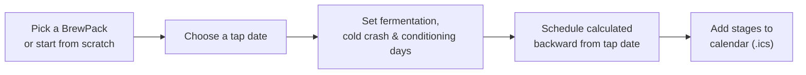
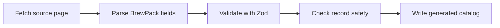
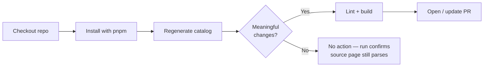
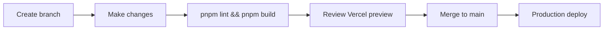

<div align="center">

# Tap Planner

**Developer Documentation**

Work backward from tap day. Tap Planner turns a target date into a brew schedule.

[](https://nextjs.org/)
[](https://www.typescriptlang.org/)
[](https://pnpm.io/)
[](https://vercel.com/)

[Live app](https://tap-planner.vercel.app/) · [Repository](https://github.com/WestbergLabs/tap-planner) · [Back to the project README](../README.md)

</div>

<br>

## Contents

- [Overview](#overview)
- [Getting started](#getting-started)
- [Common commands](#common-commands)
- [Project structure](#project-structure)
- [How scheduling works](#how-scheduling-works)
- [Official planner](#official-planner)
- [Custom recipe planner](#custom-recipe-planner)
- [Calendar export](#calendar-export)
- [BrewPack data pipeline](#brewpack-data-pipeline)
  - [Data model](#data-model)
  - [Importer](#importer)
  - [Automatic catalog monitoring](#automatic-catalog-monitoring)
- [Deployment](#deployment)
- [Data and image policy](#data-and-image-policy)
- [Current scope](#current-scope)
- [Roadmap](#roadmap)

---

## Overview

Tap Planner is a small Next.js app for people using Pinter's home brewing system. Pick a BrewPack (or your own recipe) and a date you want to tap it, and Tap Planner works backward through fermentation, an optional cold crash, and conditioning to tell you exactly when to start brewing — then lets you drop the whole schedule into your calendar.

There are two planners sharing one calculation engine:

| Planner | Route | Use it when... |
|---|---|---|
| **Official** | `/` | You're brewing a real Pinter BrewPack and want its recommended or minimum timing |
| **Custom** | `/custom` | You're brewing your own recipe, or want to override a BrewPack's default timing |

No accounts, no database, nothing stored server-side. Everything lives in the URL and the browser for the length of one calculation.

---

## Getting started

### Requirements

| Requirement | Purpose |
|---|---|
| Node.js 22 | Runs the Next.js application and importer |
| pnpm 11.15.1 | Installs dependencies and runs scripts |
| Git | Version control and branch management |

### Clone, install, run

```powershell
git clone https://github.com/WestbergLabs/tap-planner.git
cd tap-planner
pnpm install
pnpm dev
```

Then open [http://localhost:3000](http://localhost:3000).

---

## Common commands

| Command | Purpose |
|---|---|
| `pnpm dev` | Start the local development server |
| `pnpm lint` | Run lint checks |
| `pnpm build` | Create a production build |
| `pnpm import:brewpacks` | Fetch and regenerate BrewPack data |

Before pushing a change, always run both:

```powershell
pnpm lint
pnpm build
```

---

## Project structure

```text
.github/
  workflows/
    ci.yml                    # Lint + build on PRs and pushes to main
    monitor-brewpacks.yml     # Scheduled BrewPack monitoring

app/
  custom/
    page.tsx                  # Custom recipe planner  →  /custom
  globals.css                 # Global design, responsive layout, mobile fixes
  layout.tsx                  # App metadata and root layout
  page.tsx                    # Official BrewPack planner  →  /

components/
  BrewPackPicker.tsx           # Accessible BrewPack search combobox, shared by both planners

data/
  brewpacks.generated.ts       # Generated BrewPack catalog used by the app

lib/
  calendar.ts                  # Browser-only .ics calendar generation, shared by both planners
  schedule.ts                  # Date + schedule-calculation utilities, shared by both planners

public/
  tap-handles.jpg              # Local hero image

scripts/
  import-brewpacks.ts          # Scrapes, validates, and writes BrewPack data
```

`lib/schedule.ts` and `lib/calendar.ts` are the two files worth knowing well — nearly everything else in the app is UI built on top of them.

---

## How scheduling works

Both planners solve the same equation, just with different labels for the first stage:

```text
(fermentation or brewing) + cold crash + conditioning = total lead time
```

Tap Planner subtracts the total lead time from the requested tap date, then lays each stage out from that start date forward.



All date math — `parseLocalDate`, `addDays`, `subtractDays`, `formatDate`, `getTodayString`, and the backward `calculateSchedule` function — lives in `lib/schedule.ts`, so the official and custom planners never duplicate this logic.

---

## Official planner

`app/page.tsx` is the default, compact planner at `/`. It uses the shared `BrewPackPicker` to search the generated catalog, then calculates forward from the pack's recommended or minimum brew and conditioning days.

A **Customize timing** action on this page links to `/custom`, carrying the selected BrewPack's current values along as URL query parameters — see [Custom recipe planner](#custom-recipe-planner) below.

---

## Custom recipe planner

`app/custom/page.tsx` (`/custom`) lets you schedule your own recipe, or adjust an official BrewPack's timing, without touching the compact official planner. A short hero banner (the shared `public/tap-handles.jpg`, ~200px, cropped and darkened) keeps the form near the top of the page.

### Starting point

A **Starting point** toggle sits above the form:

- **Start from an official BrewPack** *(default)* — reveals the shared `BrewPackPicker`. Selecting a pack seeds the schedule name (`BrewPack Name - Custom`), style, ABV, fermentation days (recommended brew days), conditioning days, and cold-crash days (`0`). Every seeded field stays editable, and a notice confirms the official timing was applied.
- **Start from scratch** — clears the BrewPack selection and all recipe fields, keeping only a tap date already entered on the page.

### Fields and validation

| Field | Required | Rule |
|---|:---:|---|
| Schedule name | Yes | Non-empty |
| Style | No | Free text |
| ABV | No | Decimal, 0–30 |
| Fermentation days | Yes | Whole number, minimum 1 |
| Cold-crash days | Yes | Whole number, minimum 0 (default 0) |
| Conditioning days | Yes | Whole number, minimum 1 |
| Desired tap date | Yes | Date on or after today |

Validation is strict — negative values are rejected, inline messages are tied to their fields via `aria-describedby`, and nothing is calculated until every required value is valid. The custom planner uses **Fermentation** rather than **Brewing**, since the timing here is user-defined rather than a Pinter recommendation.

### Prefilling from an official BrewPack

The **Customize timing** action on the official planner passes the selected pack's id, name, style, ABV, brew (interpreted as fermentation) days, cold-crash days, conditioning days, and tap date (if entered) as **URL query parameters only**. The `id` preselects the pack in the picker, and every prefilled field remains fully editable with a notice indicating it was prefilled.

No `localStorage`, `sessionStorage`, `IndexedDB`, cookies, database, or accounts are involved — a refresh on `/custom` simply re-reads the query parameters.

### Calculation

```text
fermentation days + cold-crash days + conditioning days = total lead time
```

The cold-crash stage is omitted from the result whenever cold-crash days are `0`.

> **Nothing is stored.** Custom recipe details exist only in the browser for the current calculation and are discarded when the page is left.

---

## Calendar export

Once a schedule is calculated, both planners show an **Add schedule to calendar** action in the result card. It downloads one standards-compliant `.ics` file with an all-day event per stage:

| Planner | Stages exported |
|---|---|
| Official | Start brewing → Begin cold crash *(only if cold-crash days > 0)* → Begin conditioning → Tap day |
| Custom | Start fermentation → Begin cold crash *(only if cold-crash days > 0)* → Begin conditioning → Tap day |

Each stage event **spans its full date range** — starting on the stage's start date and ending (exclusively) on the next stage's start date. Only the tap-day event is a single day. Titles are prefixed with the BrewPack or schedule name (e.g. `Dark Matter: Tap day`, `Dark Matter - Custom: Start fermentation`), and each description includes the schedule name, style/ABV when available, the stage duration, the timing mode (official planner), the total lead time, and the live app URL.

### Shared module — `lib/calendar.ts`

All `.ics` generation lives in one place so the two pages never duplicate it. The module owns:

- calendar-text escaping (backslashes, commas, semicolons, newlines)
- `YYYYMMDD` date formatting and exclusive all-day end-date math
- UID and safe filename generation
- full `VCALENDAR` assembly and triggering the download

It contains **no** schedule-calculation logic — `lib/schedule.ts` remains the single source of truth for stage dates, which each page passes in already computed.

### All-day event handling

Events use local calendar dates, not UTC timestamps, so a stage never shifts to a neighboring day because of the viewer's time zone:

```text
DTSTART;VALUE=DATE:YYYYMMDD
DTEND;VALUE=DATE:YYYYMMDD
```

All-day iCalendar end dates are **exclusive**, so each stage's `DTEND` is the *start date of the following stage* (correctly displaying that stage through the day before, with no extra day added). Only the single-day tap event uses `DTEND` = the day after `DTSTART`, via `exclusiveEndDate`.

### Privacy

Export happens entirely client-side, via a `Blob` and an object URL that's revoked after download. Event UIDs are derived from the stage name, schedule name, and stage start date — no database required. **No calendar account access is requested**, no external calendar API is called, and nothing is stored. After a successful download, the result card announces a confirmation via `aria-live="polite"`, and never claims events were added automatically.

---

## BrewPack data pipeline

### Data model

Generated catalog: `data/brewpacks.generated.ts`

| Field | Description |
|---|---|
| `id` | Stable internal slug |
| `name` | BrewPack display name |
| `style` | Beverage style |
| `recommendedBrewDays` | Recommended brewing duration |
| `recommendedConditioningDays` | Recommended conditioning duration |
| `minimumBrewDays` | Minimum brewing duration |
| `minimumConditioningDays` | Minimum conditioning duration |
| `abv` | Alcohol by volume |
| `yeast` | Included yeast type |
| `hopperIncluded` | Whether a Hopper is included |
| `discontinued` | Optional discontinued marker |

Discontinued BrewPacks stay in the generated data but are hidden from normal search results.

### Importer

`scripts/import-brewpacks.ts` — run manually with `pnpm import:brewpacks`.



It also:

- rejects suspiciously small result sets
- checks for duplicate IDs
- identifies discontinued packs
- applies stable slug overrides where needed
- writes fully deterministic output (no changing timestamp, so Git only ever diffs real catalog changes)

The importer requires a valid `Hopper Included` value and fails loudly if Pinter removes or changes that field.

### Automatic catalog monitoring

Workflow: `.github/workflows/monitor-brewpacks.yml` — runs every Monday, or on demand from the **Actions** tab.



A failed scheduled run is itself a signal — it usually means Pinter changed the source page's structure and the importer needs maintenance. The monitor detects:

| Change | Covered |
|---|:---:|
| New or removed BrewPacks | ✅ |
| Brew or conditioning time changes | ✅ |
| ABV or style changes | ✅ |
| Yeast or Hopper changes | ✅ |
| Discontinued-status changes | ✅ |
| Source-page parsing failures | ✅ |

> Catalog updates are never merged automatically — a maintainer always reviews and merges the pull request.

---

## Deployment

Tap Planner deploys through Vercel. Merges to `main` deploy to production automatically; every branch gets its own preview deployment.



---

## Data and image policy

| | |
|---|---|
| **BrewPack data** | Sourced from publicly available Pinter documentation. |
| **Product artwork** | Not included — no redistribution license has been confirmed for official BrewPack product artwork. |

The local header image is stored at `public/tap-handles.jpg`. Any required attribution should stay visible wherever it's used.

---

## Current scope

Tap Planner focuses on schedule planning, not brewing itself.

| Included | Not included |
|---|---|
| BrewPack selection | Active brew instructions |
| Recommended and minimum timing | Fermentation monitoring |
| Custom recipe scheduling | Saved or stored recipes |
| Adjusting official BrewPack timing | Product support |
| Optional cold-crash planning | Safety guidance |
| Backward date calculation | Account or device management |
| BrewPack catalog monitoring | |

The official Pinter app remains the source of truth for active brewing instructions and support.

---

## Roadmap

| Idea | Status |
|---|---|
| Calendar export | ✅ Shipped (all-day `.ics`, browser-only) |
| Saved schedules | Planned candidate |
| Shareable schedule links | Planned candidate |
| Accessibility refinements | Ongoing |
| BrewPack imagery | Blocked — Pinter emailed for permission, awaiting response |

---

<div align="center">

[Back to the project README](../README.md)

</div>
