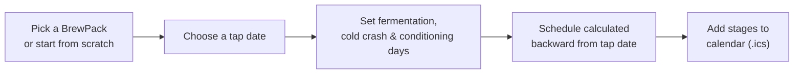
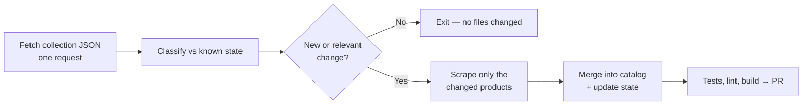
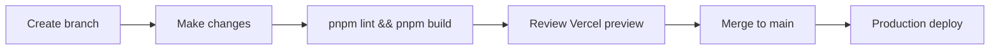

<div align="center">

# Tap Planner

**Developer Documentation**

Work backward from tap day. Tap Planner turns a target date into a brew schedule.

[](https://nextjs.org/)
[](https://www.typescriptlang.org/)
[](https://pnpm.io/)
[](https://vercel.com/)

[Live app](https://tap-planner.vercel.app/) · [Repository](https://github.com/WestbergLabs/tap-planner) · [Back to the project README](../README.md)

</div>

<br>

## Contents

- [Overview](#overview)
- [Getting started](#getting-started)
- [Common commands](#common-commands)
- [Project structure](#project-structure)
- [How scheduling works](#how-scheduling-works)
- [Official planner](#official-planner)
- [Custom recipe planner](#custom-recipe-planner)
- [Feasibility checks](#feasibility-checks)
- [Calendar export](#calendar-export)
- [BrewPack data pipeline](#brewpack-data-pipeline)
  - [Data model](#data-model)
  - [Sources](#sources)
  - [Importer](#importer)
  - [Shopify-based discovery](#shopify-based-discovery)
- [Deployment](#deployment)
- [Data and image policy](#data-and-image-policy)
- [Current scope](#current-scope)
- [Roadmap](#roadmap)

---

## Overview

Tap Planner is a small Next.js app for people using Pinter's home brewing system. Pick a BrewPack (or your own recipe) and a date you want to tap it, and Tap Planner works backward through fermentation, an optional cold crash, and conditioning to tell you exactly when to start brewing — then lets you drop the whole schedule into your calendar.

There are two planners sharing one calculation engine:

| Planner | Route | Use it when... |
|---|---|---|
| **Official** | `/` | You're brewing a real Pinter BrewPack and want its recommended or minimum timing |
| **Custom** | `/custom` | You're brewing your own recipe, or want to override a BrewPack's default timing |

No accounts, no database, nothing stored server-side. Everything lives in the URL and the browser for the length of one calculation.

---

## Getting started

### Requirements

| Requirement | Purpose |
|---|---|
| Node.js 22 | Runs the Next.js application and importer |
| pnpm 11.15.1 | Installs dependencies and runs scripts |
| Git | Version control and branch management |

### Clone, install, run

```powershell
git clone https://github.com/WestbergLabs/tap-planner.git
cd tap-planner
pnpm install
pnpm dev
```

Then open [http://localhost:3000](http://localhost:3000).

---

## Common commands

| Command | Purpose |
|---|---|
| `pnpm dev` | Start the local development server |
| `pnpm lint` | Run lint checks |
| `pnpm build` | Create a production build |
| `pnpm test` | Run the discovery unit tests |
| `pnpm import:brewpacks` | Fetch and regenerate the full BrewPack catalog |
| `pnpm scan:quick` | Quick discovery scan (regenerates only on a relevant change) |
| `pnpm scan:full` | Full verification scan (rebuild catalog + discovery state) |

Before pushing a change, always run both:

```powershell
pnpm lint
pnpm build
```

---

## Project structure

```text
.github/
  workflows/
    ci.yml                          # Lint + build on PRs and pushes to main
    brewpack-quick-scan.yml         # ~6-hourly Shopify discovery scan
    brewpack-full-verification.yml  # Weekly full re-verification

app/
  custom/
    page.tsx                  # Custom recipe planner  →  /custom
  globals.css                 # Global design, responsive layout, mobile fixes
  layout.tsx                  # App metadata and root layout
  page.tsx                    # Official BrewPack planner  →  /

components/
  BrewPackPicker.tsx           # Accessible BrewPack search combobox, shared by both planners

data/
  brewpacks.generated.ts       # Generated BrewPack catalog used by the app
  pinter-product-state.json    # Discovery state (Shopify id/handle/fingerprint per product)

lib/
  calendar.ts                  # Browser-only .ics calendar generation, shared by both planners
  schedule.ts                  # Date + schedule-calculation utilities, shared by both planners

public/
  tap-handles.jpg              # Local hero image

scripts/
  import-brewpacks.ts          # Full catalog build: resolve + validate + write
  brewpack-scan.ts             # Two-level discovery scanner (quick / full)
  lib/
    discovery.ts               # Pure discovery logic (fingerprint, classify, state)
    discovery.test.ts          # Discovery unit tests (pnpm test)
    http.ts                    # Fetch with user agent, timeout, retry, 429/5xx
```

`lib/schedule.ts` and `lib/calendar.ts` are the two files worth knowing well — nearly everything else in the app is UI built on top of them.

---

## How scheduling works

Both planners solve the same equation, just with different labels for the first stage:

```text
(fermentation or brewing) + cold crash + conditioning = total lead time
```

Tap Planner subtracts the total lead time from the requested tap date, then lays each stage out from that start date forward.


```mermaid
flowchart LR
    A["Pick a BrewPack\nor start from scratch"] --> B["Choose a tap date"]
    B --> C["Set fermentation,\ncold crash & conditioning days"]
    C --> D["Schedule calculated\nbackward from tap date"]
    D --> E["Add stages to\ncalendar (.ics)"]
```

All date math — `parseLocalDate`, `addDays`, `subtractDays`, `formatDate`, `getTodayString`, and the backward `calculateSchedule` function — lives in `lib/schedule.ts`, so the official and custom planners never duplicate this logic. The same module also owns the [feasibility](#feasibility-checks) helpers (`getAvailableLeadDays`, `getRequiredLeadDays`, `getEarliestTapDate`, `isScheduleFeasible`, `getOfficialTimingAvailability`) — feasibility never lives in `lib/calendar.ts`.

---

## Official planner

`app/page.tsx` is the default, compact planner at `/`. It uses the shared `BrewPackPicker` to search the generated catalog, then calculates forward from the pack's recommended or minimum brew and conditioning days.

A **Customize timing** action on this page links to `/custom`, carrying the selected BrewPack's current values along as URL query parameters — see [Custom recipe planner](#custom-recipe-planner) below.

---

## Custom recipe planner

`app/custom/page.tsx` (`/custom`) lets you schedule your own recipe, or adjust an official BrewPack's timing, without touching the compact official planner. A short hero banner (the shared `public/tap-handles.jpg`, ~200px, cropped and darkened) keeps the form near the top of the page.

### Starting point

A **Starting point** toggle sits above the form:

- **Start from an official BrewPack** *(default)* — reveals the shared `BrewPackPicker`. Selecting a pack seeds the schedule name (`BrewPack Name - Custom`), style, ABV, fermentation days (recommended brew days), conditioning days, and cold-crash days (`0`). Every seeded field stays editable, and a notice confirms the official timing was applied.
- **Start from scratch** — clears the BrewPack selection and all recipe fields, keeping only a tap date already entered on the page.

### Fields and validation

| Field | Required | Rule |
|---|:---:|---|
| Schedule name | Yes | Non-empty |
| Style | No | Free text |
| ABV | No | Decimal, 0–30 |
| Fermentation days | Yes | Whole number, minimum 1 |
| Cold-crash days | Yes | Whole number, minimum 0 (default 0) |
| Conditioning days | Yes | Whole number, minimum 1 |
| Desired tap date | Yes | Date on or after today |

Validation is strict — negative values are rejected, inline messages are tied to their fields via `aria-describedby`, and nothing is calculated until every required value is valid. The custom planner uses **Fermentation** rather than **Brewing**, since the timing here is user-defined rather than a Pinter recommendation.

### Prefilling from an official BrewPack

The **Customize timing** action on the official planner passes the selected pack's id, name, style, ABV, brew (interpreted as fermentation) days, cold-crash days, conditioning days, and tap date (if entered) as **URL query parameters only**. The `id` preselects the pack in the picker, and every prefilled field remains fully editable with a notice indicating it was prefilled.

No `localStorage`, `sessionStorage`, `IndexedDB`, cookies, database, or accounts are involved — a refresh on `/custom` simply re-reads the query parameters.

### Calculation

```text
fermentation days + cold-crash days + conditioning days = total lead time
```

The cold-crash stage is omitted from the result whenever cold-crash days are `0`.

> **Nothing is stored.** Custom recipe details exist only in the browser for the current calculation and are discarded when the page is left.

---

## Feasibility checks

The two planners treat a brew that would have to start *before today* very differently, and deliberately so:

- **Official BrewPacks enforce published timing.** A pack has authoritative recommended and minimum durations, so if neither fits before the chosen tap date the official planner hard-stops — it disables the timing modes and **Calculate** and produces no result.
- **Custom schedules are advisory.** A custom recipe's durations are user-defined; Tap Planner is a planning tool, not the authority on how long a recipe must ferment or condition. It calculates the dates, warns when the start lands before today, and **still lets the user calculate and export** — it never calls a custom schedule impossible or forces a change.

Tap Planner does not judge whether custom recipe durations are appropriate.

All the date math is shared in `lib/schedule.ts` (local-date based, no UTC/timezone shifting) so the two pages never disagree:

| Helper | Returns |
|---|---|
| `getAvailableLeadDays(tapDate, today?)` | Calendar days between today and the tap date (negative if the tap date has passed) |
| `getRequiredLeadDays(durations)` | `fermentation + cold crash + conditioning` |
| `getEarliestTapDate(durations, today?)` | `today + required lead`, the soonest a schedule can tap |
| `isScheduleFeasible(tapDate, durations, today?)` | `required <= available` — equivalently, the brew start is today or later |
| `getOfficialTimingAvailability(tapDate, input, today?)` | `{ recommendedFits, minimumFits, earliestTapDateWithRecommended, earliestTapDateWithMinimum }` |

### Official planner

The form is reordered into a step-by-step flow — **tap date → BrewPack → timing → cold crash → calculate** — so availability is known before a mode is chosen. The tap-date field enforces `min` **and** is validated programmatically (the browser restriction alone isn't trusted). After a tap date and BrewPack are chosen, `getOfficialTimingAvailability` evaluates *both* modes against the selected cold crash, recomputing whenever the tap date, BrewPack, or cold-crash duration changes. Three states:

| State | Condition | Behavior |
|---|---|---|
| **Available** | Both modes fit | Both timing options enabled; recommended stays default; teal confirmation message |
| **Minimum only** | Only minimum fits | Recommended radio `disabled`; the effective mode falls back to minimum (derived during render, so a disabled mode can't be selected via stale state, keyboard, or submission); amber message + a **Use recommended date: {date}** recovery action |
| **Not enough time** | Neither fits | Both radios and **Calculate** disabled; any stale result cleared; no calendar export; red message + a **Use earliest minimum date: {date}** recovery action |

#### Date recovery

Rather than leaving the user to guess a workable date, both non-ideal states offer a one-click recovery action inside the message panel:

- **Minimum only → Use recommended date:** jumps the tap date to `earliestTapDateWithRecommended` (today + recommended brew + selected cold crash + recommended conditioning) and selects **Recommended**, landing in the *Available* state.
- **Not enough time → Use earliest minimum date:** jumps the tap date to `earliestTapDateWithMinimum` and selects **Minimum**, landing in *Minimum only* (or *Available* when the modes tie).

Both actions reuse the shared `getOfficialTimingAvailability` dates, keep the BrewPack and cold-crash selection, clear any stale result (so calendar export disappears until the user recalculates), and behave exactly like a manual tap-date change — feasibility re-runs and the input visibly updates. They never auto-calculate the final schedule.

### Custom planner

The tap date is moved above the recipe timing fields. Once the three duration fields are valid and a tap date is present, a live `aria-live` advisory reports the calculated start date:

- **Starts today or later** — a confirmation: *"This schedule begins {start} and can be ready by {tap}."*
- **Starts before today** — an advisory warning (amber, deliberately not styled as a fatal error): *"Based on your current settings, this schedule would have started on {date}."* followed by guidance to continue if the brew is already underway, or otherwise move the tap date later or shorten a stage, plus *"Suggested earliest tap date using these durations: {date}."* and a **Use {date}** action that only updates the tap-date field.

A past start **never** disables **Calculate**, never clears the result on its own, and never hides calendar export. Before exporting a past-dated schedule the result card retains a short advisory (*"This calendar includes stages that began before today…"*); the ICS stage structure is unchanged and past events are exported as-is. Only genuinely invalid input — missing or invalid tap date, or blank / negative / nonnumeric / out-of-range durations — blocks calculation and export. Prefilled BrewPack timing (from the official planner's **Customize timing** link) is treated as a plain custom schedule and re-evaluated the instant any duration is edited.

### Earliest possible tap date

The "earliest" shown in every message is `getEarliestTapDate(durations)` = `today + required lead time`, i.e. the soonest tap date whose brew starts today. On the official planner the message reports the minimum-timing earliest date, since that is the sooner of the two.

### Guardrails

Neither planner trusts UI state alone, but the rules stay clearly separated:

- **Official** — the Calculate handler re-checks tap date present → today or later → fields valid → the selected timing mode currently fits → brew start today or later, and refuses (clearing stale results, no export) if any check fails.
- **Custom** — the handler blocks only genuinely invalid input via `validate()`; a start before today is advisory and still calculates and exports. Custom never reuses the official hard-stop.

On both pages the **Add schedule to calendar** action lives inside the result card, so a schedule that was never calculated can never be exported.

---

## Calendar export

Once a schedule is calculated, both planners show an **Add schedule to calendar** action in the result card. It downloads one standards-compliant `.ics` file with an all-day event per stage:

| Planner | Stages exported |
|---|---|
| Official | Start brewing → Begin cold crash *(only if cold-crash days > 0)* → Begin conditioning → Tap day |
| Custom | Start fermentation → Begin cold crash *(only if cold-crash days > 0)* → Begin conditioning → Tap day |

Each stage event **spans its full date range** — starting on the stage's start date and ending (exclusively) on the next stage's start date. Only the tap-day event is a single day. Titles are prefixed with the BrewPack or schedule name (e.g. `Dark Matter: Tap day`, `Dark Matter - Custom: Start fermentation`), and each description includes the schedule name, style/ABV when available, the stage duration, the timing mode (official planner), the total lead time, and the live app URL.

### Shared module — `lib/calendar.ts`

All `.ics` generation lives in one place so the two pages never duplicate it. The module owns:

- calendar-text escaping (backslashes, commas, semicolons, newlines)
- `YYYYMMDD` date formatting and exclusive all-day end-date math
- UID and safe filename generation
- full `VCALENDAR` assembly and triggering the download

It contains **no** schedule-calculation logic — `lib/schedule.ts` remains the single source of truth for stage dates, which each page passes in already computed.

### All-day event handling

Events use local calendar dates, not UTC timestamps, so a stage never shifts to a neighboring day because of the viewer's time zone:

```text
DTSTART;VALUE=DATE:YYYYMMDD
DTEND;VALUE=DATE:YYYYMMDD
```

All-day iCalendar end dates are **exclusive**, so each stage's `DTEND` is the *start date of the following stage* (correctly displaying that stage through the day before, with no extra day added). Only the single-day tap event uses `DTEND` = the day after `DTSTART`, via `exclusiveEndDate`.

### Privacy

Export happens entirely client-side, via a `Blob` and an object URL that's revoked after download. Event UIDs are derived from the stage name, schedule name, and stage start date — no database required. **No calendar account access is requested**, no external calendar API is called, and nothing is stored. After a successful download, the result card announces a confirmation via `aria-live="polite"`, and never claims events were added automatically.

---

## BrewPack data pipeline

### Data model

Generated catalog: `data/brewpacks.generated.ts`

| Field | Description |
|---|---|
| `id` | Stable internal slug |
| `name` | BrewPack display name |
| `style` | Beverage style |
| `recommendedBrewDays` | Recommended brewing duration |
| `recommendedConditioningDays` | Recommended conditioning duration |
| `minimumBrewDays` | Minimum brewing duration |
| `minimumConditioningDays` | Minimum conditioning duration |
| `abv` | Alcohol by volume |
| `yeast` | Included yeast type |
| `hopperIncluded` | Whether a Hopper is included |
| `discontinued` | Optional discontinued marker |

Discontinued BrewPacks stay in the generated data but are hidden from normal search results.

### Sources

BrewPack data comes from Pinter's public storefront, preferring structured Shopify data over scraping visible page text:

| Source | Used for |
|---|---|
| **Fresh Beer collection JSON** — `https://pinter.com/collections/fresh-beer/products.json?limit=250` | Discovery + identity: product `id`, `handle`, `title`, `created_at`, `published_at`, availability, tags, description |
| **Product pages** — `https://pinter.com/products/{handle}` | Timing specs (recommended/minimum brew & conditioning days), ABV, style, yeast |
| **Support "Pinter Packs" article** *(backup)* | Retaining discontinued/seasonal packs no longer on sale, and filling any spec a product page omits |

The collection JSON is the primary source and exposes both `created_at` and `published_at`. Only published products are ever added to the catalog.

### Importer

`scripts/import-brewpacks.ts` — the full catalog build, run manually with `pnpm import:brewpacks` and reused by the full verification scan. It resolves every current product against the support backup, validates each with Zod, and writes deterministic output (no timestamps, so Git only diffs real catalog changes). Safety guards: it refuses a suspiciously small result or duplicate ids, writes the generated file atomically (temp file + rename), and — crucially — a single product that cannot be fully resolved is set aside as **pending** rather than aborting the whole run or dropping the rest of the catalog.

### Shopify-based discovery

Discovery runs at two levels so new releases are found quickly without re-scraping every product page on every run. Discovery state lives in `data/pinter-product-state.json` — one entry per collection product (`id`, `handle`, `title`, `publishedAt`, `available`, a relevant-field `fingerprint`, and an optional `pending` flag). It stores only what change detection needs — never the full Shopify response, and no `lastSeenAt`-style timestamp that would cause a commit on every scan. (A separate state file is used because the generated catalog keys packs on a name-slug and stores neither the Shopify id nor the handle, so known identity can't be derived from it.)

Identity is the **Shopify product id** (stable across renames); the **handle** is retained because it determines the product URL. Titles are never used as identity.

#### Quick discovery scan — approximately every 6 hours

`pnpm scan:quick` · `.github/workflows/brewpack-quick-scan.yml`


```mermaid
flowchart LR
    A[Fetch collection JSON<br/>one request] --> B[Classify vs known state]
    B --> C{New or relevant<br/>change?}
    C -->|No| D[Exit — no files changed]
    C -->|Yes| E[Scrape only the<br/>changed products]
    E --> F[Merge into catalog<br/>+ update state]
    F --> G[Tests, lint, build → PR]
```

The steady state is a single collection request and **no file writes**. Detailed scraping is invoked only for products that are actually new or relevantly changed. This is a discovery check, not a guarantee of immediate availability — it runs roughly every six hours.

**Relevant-change detection** compares a deterministic fingerprint of the fields Tap Planner cares about — id, handle, title, `published_at`, availability, description content, and classification tags. Irrelevant storefront data (cart quantity, subscription plan ids, inventory counts, prices, marketing markup) is excluded so it never triggers reprocessing. A product is detected when: its id is new; its handle or title changed; it became newly published; it became available or unavailable; or its description/tags changed.

**Pending products.** A product that is published but whose required timing specs can't be extracted yet (a page not fully populated, or temporarily unreachable) is recorded with `pending: true` and **not** added to the planner — the missing fields are logged, and it is re-checked on every later scan until complete, so it is never marked permanently processed. Unpublished (draft) products are ignored entirely until they publish.

#### Weekly full verification

`pnpm scan:full` · `.github/workflows/brewpack-full-verification.yml` — Monday 07:30 UTC

The authority pass re-resolves **every** current product, rebuilds the catalog and state from scratch, and reconciles what the incremental quick scan intentionally defers — retention of packs that dropped off the shop, renames, and removals. A no-change run confirms the sources still parse.

Both workflows keep manual dispatch, share a `brewpacks-scan` concurrency group (so a quick and full scan never overlap or race on the automation branch), and open/update the same catalog pull request. Changes are **never merged automatically** — a maintainer always reviews the diff, which the workflow first validates with `pnpm test`, `pnpm lint`, and `pnpm build`.

#### Failure safety

Every request carries a Tap Planner user agent and has a timeout with limited retries for transient failures (network errors, HTTP 429 honoring `Retry-After`, and 5xx). A persistent failure fails the run loudly rather than corrupting data: the generated file is written atomically, the small-result and duplicate-id guards refuse to overwrite a healthy catalog with a broken one, and if the expected Shopify structure disappears the scan stops and preserves the existing generated data.

> Tap Planner does not verify that Pinter's published timings are correct — it mirrors them. A maintainer reviews every automated catalog PR.

---

## Deployment

Tap Planner deploys through Vercel. Merges to `main` deploy to production automatically; every branch gets its own preview deployment.


```mermaid
flowchart LR
    A[Create branch] --> B[Make changes]
    B --> C[pnpm lint && pnpm build]
    C --> D[Review Vercel preview]
    D --> E[Merge to main]
    E --> F[Production deploy]
```

---

## Data and image policy

| | |
|---|---|
| **BrewPack data** | Sourced from publicly available Pinter documentation. |
| **Product artwork** | Not included — no redistribution license has been confirmed for official BrewPack product artwork. |

The local header image is stored at `public/tap-handles.jpg`. Any required attribution should stay visible wherever it's used.

---

## Current scope

Tap Planner focuses on schedule planning, not brewing itself.

| Included | Not included |
|---|---|
| BrewPack selection | Active brew instructions |
| Recommended and minimum timing | Fermentation monitoring |
| Custom recipe scheduling | Saved or stored recipes |
| Adjusting official BrewPack timing | Product support |
| Optional cold-crash planning | Safety guidance |
| Backward date calculation | Account or device management |
| BrewPack catalog monitoring | |

The official Pinter app remains the source of truth for active brewing instructions and support.

---

## Roadmap

| Idea | Status |
|---|---|
| Calendar export | ✅ Shipped (all-day `.ics`, browser-only) |
| Feasibility checks | ✅ Shipped (official recommended/minimum + custom advisory, with date recovery) |
| Smarter BrewPack scanning | ✅ Shipped (quick ~6h discovery + weekly full verification) |
| Saved schedules | Planned candidate |
| Shareable schedule links | Planned candidate |
| Accessibility refinements | Ongoing |
| BrewPack imagery | Blocked — Pinter emailed for permission, awaiting response |

---

<div align="center">

[Back to the project README](../README.md)

</div>
